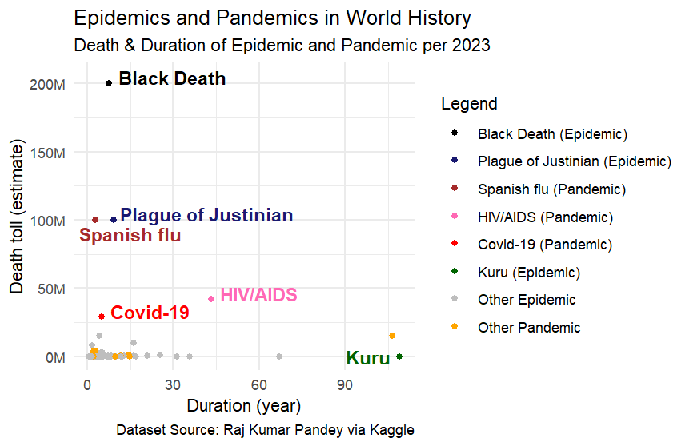

# Epidemics and Pandemics in World History

This R-based analysis explores the relationship between death toll and duration across major epidemics and pandemics throughout history.

### Key Insights:
1. A global spread (i.e., being a pandemic) doesn’t necessarily correlate with higher mortality. Some pandemics had relatively low death tolls, and vice versa.
2. The duration also does not correlate with its death toll. Remarkably, the three deadliest plagues in history lasted less than a decade.
3. The Black Death was a historical nightmare.

Dataset: https://www.kaggle.com/datasets/rajkumarpandey02/list-of-epidemics-and-pandemics-in-world-history
